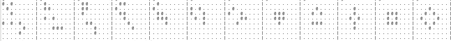
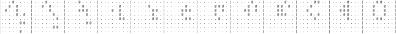
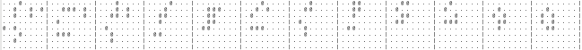
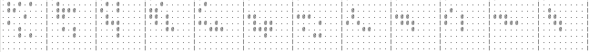
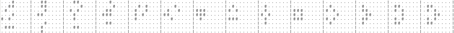

### The game of Life

The [game of LIFE](https://en.wikipedia.org/wiki/Conway%27s_Game_of_Life) is a famous cellular automaton with fascinating behavior -- famous enough that a Google search for "game of life" even shows an animation of it in the background of the search results! There are lots of good resources for learning about it, which I won't attempt to replicate here. You can play a simple version at [playgameoflife.com](https://playgameoflife.com/), or simulate massive grids with [Golly](https://golly.sourceforge.io/webapp/golly.html).

### Mobile paths in Life

At the [16th Gathering for Gardner](https://www.gathering4gardner.org/g4g16-info/), [Donald Knuth](https://www-cs-faculty.stanford.edu/~knuth/) gave an entertaining question-and-answer session. At the end he mentioned a couple open problems, including Exercise 7.2.2.2-68 from Volume 4 of the Art of Computer Programming, which asks about certain small, constrained patterns within Life.

He defines a "mobile" pattern in Life as one in which no cell stays alive for more than four consecutive generations. The [glider](https://en.wikipedia.org/wiki/Glider_(Conway%27s_Game_of_Life)) is the simplest mobile pattern, consisting of only five cells that "walk" diagonally across the grid through successive generations. Exercise 7.2.2.2-68 asks how long a pattern in Life can last within an 8x8 board while maintaining a population between 6 and 10, and with the restriction that no cell stays alive for more than 4 consecutive generations. The topic is discussed in the context of SAT-solvers, but this seemed like a tractable problem for special-purpose code, so I took that approach.

### Results

Knuth conjectures that 11 generations is the maximum, and I confirmed that this is correct. That maximum lifetime can be achieved with only 9 starting cells; with 6, 7, or 8 starting cells the maximum is 8, 9, or 10 generations respectively.

Here is an example of a 9-cell pattern which lasts 11 generations before exceeding the population limit (it will hit population 12 in the next generation):

With 10 starting cells we get several other outcomes, such as the ones below; the first exceeds population 10, and the other two run afoul of the age-4 limit. There is no essentially different outcome which exceeds the chessboard bounds or becomes too small in the 12th generation.

Of all possible 6-to-10 cell starting patterns, roughly 69% become too small; 8% become too big; 10% have cells which live too long (of which 40% become [still lifes](https://en.wikipedia.org/wiki/Still_life_(cellular_automaton))), and 13% grow outside the chessboard.

Another possibility is the "petri dish", where we do not allow cells to spawn outside the chessboard but continue following the pattern within. This allows things to last up to two more generations. All the maximum-length patterns start like the 9-cell pattern above, but briefly evade the population limit by constructing the hollow 3x3 square on the edge of the chessboard:

Beyond representing the chessboard as a single 64-bit integer, the code is not especially optimized, and takes about 14 hours on a single core of an [Ampere Altra](https://amperecomputing.com/products/processors) system running at 3GHz.
