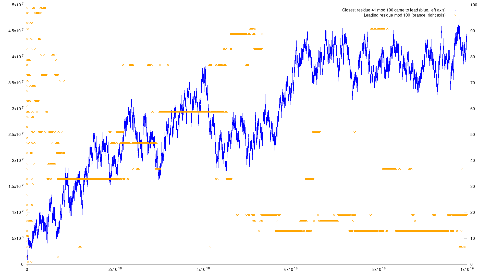
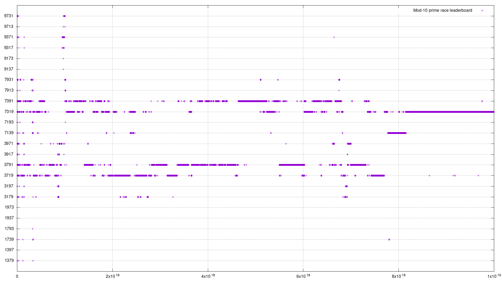
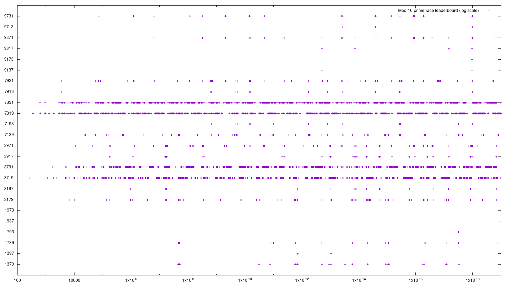
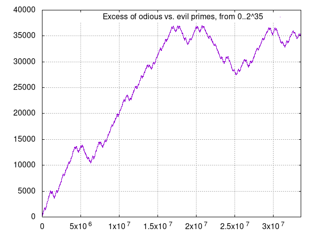
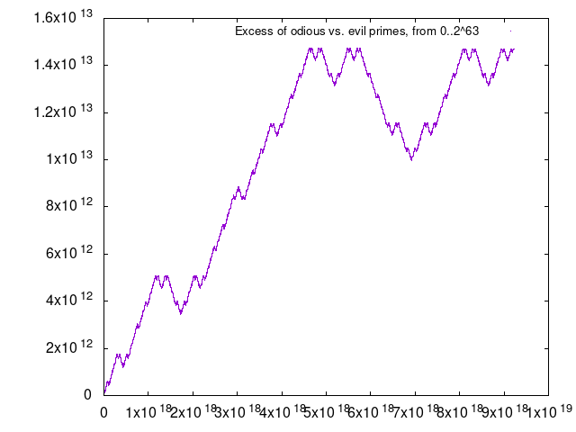
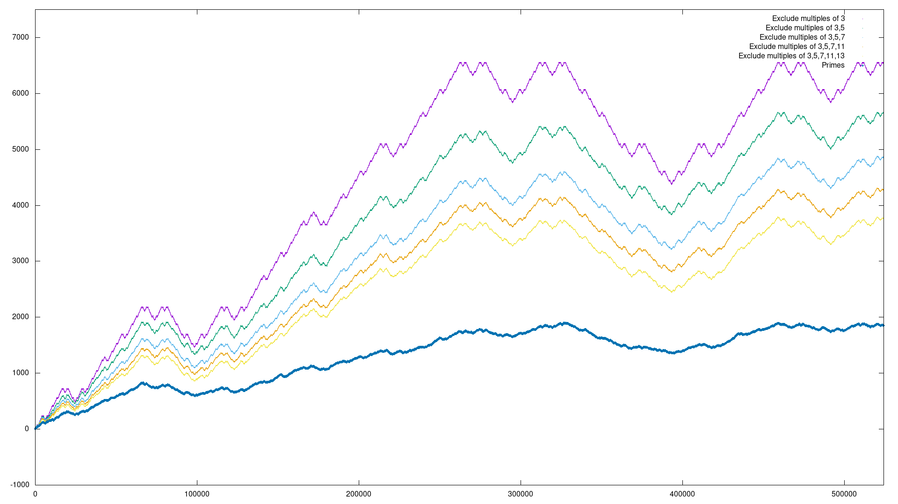
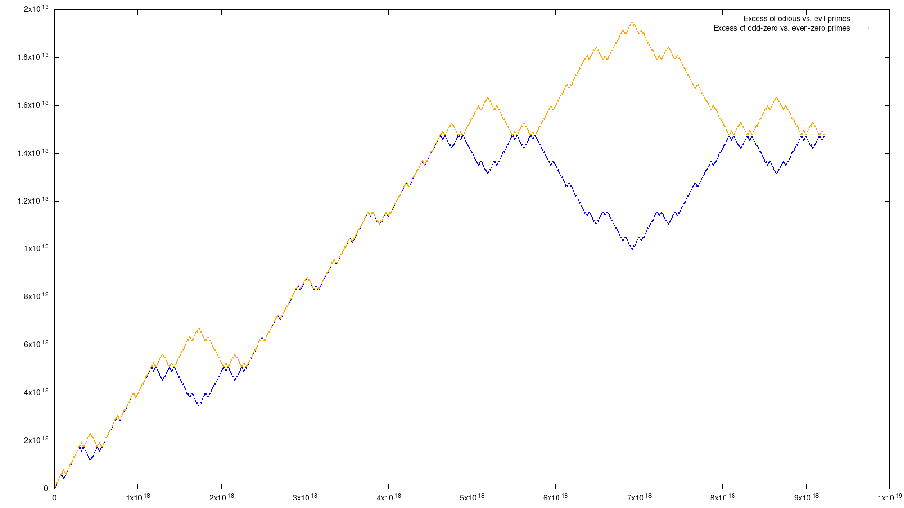

## Background

Thanks to [Mike Keith](https://www.cadaeic.net/) for introducing me to this topic.

The [Chebyshev bias](https://en.wikipedia.org/wiki/Chebyshev%27s_bias) is the observation that if one counts primes mod 4 up to some limit, there are very often more primes of the form 4k+3 than 4k+1. In general, primes mod *M* are "lumpily" distributed, with some residues trailing others for long (sometimes extremely long) stretches; however Littlewood proved that every residue will lead at some point, and in fact will lead an infinite number of times. There's a good overview in this [excellent paper](https://dms.umontreal.ca/~andrew/PDF/PrimeRace.pdf) by Andrew Granville and Greg Martin.

Mike's initial question was about primes mod 100. There are 40 possible residues, and 39 of them are known to lead at some point; the last of those is 43, which takes the lead at 11342219743. Only 41 has never been in front, so naturally we'd like to find the place where it takes the lead (which it must, eventually).

Some other races we'll look at:
- [A390417](https://oeis.org/A390417) - For mod 10, there are four possible residues (1, 3, 7, and 9). Look for when each of the 24 possible "leaderboard" rankings occurs. Five of the possible rankings had not been found.
- [A275939](https://oeis.org/A275939) - For every modulus *q*, consider the race between residue 1 and -1. Residue 1 is generally disadvantaged, so the question is when does 1 take the lead. The answer was known for all *q* < 1000, except for *q*=12 and *q*=24.
- [A380877](https://oeis.org/A380877) - When is residue 1 tied with residue 7, mod 12. Only 8 terms were known, the largest of which was 461.
- [A130911](https://oeis.org/A130911) - Race between evil primes (which have an even number of 1s in their binary representation) and odious primes (which have an odd number of 1s). It is conjectured that evil never leads after the first 3 primes.
- [A156549](https://oeis.org/A156549) - Race between primes which have an even number of 0s in binary vs. those which have an odd number of 0s. It appears that an odd number of 0s always leads. It's somewhat surprising that odd leads for both 1s and 0s; more on this below.

## Computation

I look at these races for all primes up to 1019. The basic code for counting a prime race is quite simple: using the super-fast [primesieve](https://github.com/kimwalisch/primesieve) library, generate sequential primes, and count up their residues mod some value. But to make real progress we want to parallelize this process; while counting residues within some range, we don't know the full counts and so we can't tell whether one residue takes the lead.

To see the solution, we can take the mod-100 race as an example. We are interested only in residue 41, so as we process each block we track the largest lead that 41 ever has over each of the other residues, and output that at the end of the block, along with the counts for each residue. Then in a post-processing step we look at the output of each block sequentially, calculating the total count for each residue, and checking whether 41 got far enough ahead within this block that it could have taken the lead.

For example, say that at the beginning of this block, 41 was behind residue R by 1000. If the largest lead that 41 had over R at any point within this block is less than or equal to 1000, then it can't possibly pass R overall; on the other hand, if the largest lead within this block is greater than 1000, then 41 will pass R at some point. If 41 passes *all* of the other residues, then it's possible that it takes the overall lead -- though not guaranteed, because even if it is ahead of every other residue at some point, it may not be ahead of all of them at the same time.

If we find a block where 41 passes all the other residues, we'll have to rerun that block in "safe mode", starting with the full counts up to that point, to see if it really does come out ahead.

For simpler 2-way races, like the residue +/-1 race, there's no doubt -- if 1's largest lead is greater than its starting deficit, then it takes the lead within this block. But we'll still need to rerun in safe mode to find exactly where.

For the mod-10 "leaderboard" race, we track the largest lead of every residue over every other residue (4*3 = 12 values total), so that we can check whether, within each block, first place is ahead of second, third, and fourth; second is ahead of third and fourth; and third is ahead of fourth. Again, we'll need to rerun to check whether this leaderboard really happens, and find exactly where.

## Results

### Mod-100 race

Sadly, residue 41 never takes the lead up to 10^19. Here's a graph which shows, within each block of 2.5*1012, the closest 41 came to the lead, and which residue is in the lead. So although 41 must take the lead eventually, it looks like it could be a long way out.

### Mod-10 race

In the mod-10 race there are four possible residues (1, 3, 7, and 9), and we're checking for every one of the 24 orderings of how they rank ([A390417](https://oeis.org/A390417)). I filled in three missing terms from that sequence:

- Ordering 9,7,1,3 happens at prime 2,780,347,060,681,349
- Ordering 1,7,9,3 happens at prime 322,521,515,161,309,103
- Ordering 9,1,7,3 happens at prime 970,532,570,111,534,567

But the remaining two orderings (1,9,3,7 and 1,9,7,3) do not appear up to 1019. Here are graphs showing which ordering is in the lead, first on a linear scale and then on a log scale:

### 1 vs. -1, mod 12 and mod 24

In this race, we're looking for when residue 1 overtakes residue -1, for moduli 12 and 24. (All other moduli under 1000 are already known, in [A275939](https://oeis.org/A275939).) In a comment in the OEIS, Kevin Ford says: "In the case of the mod 12 race, it is probably around exp(187.536), or about 2.79 x 1081.  For the mod 24 race, it's about exp(43.453)=7.437... x 1018."

Sure enough, I found that for mod 24, residue 1 takes the lead over -1 at prime 7,390,188,907,282,602,529, very close to Ford's prediction. And, not surprisingly, 1 never leads for mod 12 up to 1019.

### 1 vs. 7, mod 12

Here we are looking for primes where residues 1 at 7 (mod 12) are tied ([A380877](https://oeis.org/A380877). The first tie after prime 461 is at 27489101529397. That is the start of the first of three regions where the two residues are roughly equal and trade places many times:
- From 27489101529397 to 27555497263759
- From 97520543924496577 to 98977289882800319
- From 108246985167355561 to 108251357023703549

After that, 7 leads 1 all the way out to 1019.

### Odious vs. evil

The race between odious and evil primes is fascinating. At first glance, one might expect primes to have as little structure in their binary bits as they do in their decimal digits, and that therefore the chances of having an even or odd number of 1's in binary would be balanced. However this appears not to be the case. [Vladimir Shevelev](https://arxiv.org/abs/0706.0786) gives some explanation as to why, and conjectures that after the first few primes, odious primes always lead. This is certainly true as far as 1019. But what I find really striking is that the cumulative lead of odious over evil shows a fractal structure which repeats every power of 4, as seen in these graphs, which have *n* on the X axis and the delta between odious and evil primes up to *n* on the Y, over vastly different ranges:

Looking at some power-of-4 ranges, the shape of the graph is the same from [251 - 253](odious-51-53.png), [253 - 255](odious-53-55.png), and [255 - 257](odious-55-57.png).

The parity of 1's is balanced if we look at all integers, or all odd integers. But this same structure emerges as soon as we exclude multiples of 3. The graph below shows the odd-ones vs. even-ones delta when excluding multiples of 3, or 3 and 5, or 3 and 5 and 7, etc. The more prime multiples we exclude, the messier the line gets, until the bottom blue line, which shows the odious/evil race for just the primes; at this scale, there is no discernable pattern. But as we see in the graphs above, at large scales the graph of primes is indistinguishable from the graph when we exclude just multiples of 3.

For me, this was definitely the most surprising result of this project!

### Odd-zeros vs. even-zeros

Related to the odious/evil race is the race between primes which have an odd number of 0s in binary vs. an even number of 0s. For numbers with an even number of bits -- where odious's lead grows steeply -- the parity of the number of 1s and 0s is the same; for numbers with an odd number of bits -- where the odious vs. evil race is overall flat -- the parity of 1s and 0s is opposite. The result is that odd-zeros seem to always lead, as seen here, with odious vs. evil in blue and odd-zero vs. even-zero in orange:

## Prime tabulation

As long as I was generating primes over a large range, I thought I might as well collect some other information along the way. Some of the basic counts of primes, such as the number of primes below 10n, are already known to large numbers. But I was able to extend a number of other sequences:
- [A095005](https://oeis.org/A095005) and [A095006](https://oeis.org/A095006) - number of odious/evil primes in power-of-2 ranges
- [A127977](https://oeis.org/A127977) - minimum lead of odious primes over evil primes in power-of-2 intervals
- [A129542](https://oeis.org/A129542) and [A129697](https://oeis.org/A129697) - number of isolated (non-twin) primes less than 10n, and their sum
- [A033843](https://oeis.org/A033843) - number of twin primes less than 2n
- [A007508](https://oeis.org/A007508) and [A118552](https://oeis.org/A118552) - number of twin primes less than 10n, and their sum
- [A396644](https://oeis.org/A396644) (new) - number of cousin primes less than 2n
- [A080840](https://oeis.org/A080840) and [A152127](https://oeis.org/A152127) - number of cousin primes (primes 4 apart) less than 10n, and their sum
- [A080841](https://oeis.org/A080841) - number of primes 6 apart less than 10n
- [A093738](https://oeis.org/A093738) and [A341843](https://oeis.org/A341843) - number of *consecutive* primes 6 apart less than 10n, or less than 2n
- [A091644](https://oeis.org/A091644) and friends - number of primes less than 10n containing digit *X*
- [A091634](https://oeis.org/A091634) and friends - number of primes less than 10n which do *not* contain digit *X*
- [A231590](https://oeis.org/A231590) and friends - total number of digit *X* in primes less than 10n
- [A244191](https://oeis.org/A244191) and [A244265](https://oeis.org/A244265) - most common final digit for primes less than 10n, and its frequency
- [A244192](https://oeis.org/A244192) and [A244267](https://oeis.org/A244267) - most common 2-digit ending of primes less than 10n, and its frequency
- [A091117](https://oeis.org/A091117) - number of primes which are 2 mod 5 less than 10n
- [A091115](https://oeis.org/A091115) and friends - mod-6 residue counts less than 10n
- [A091120](https://oeis.org/A091120) and friends - mod-7 residue counts less than 10n
- [A091126](https://oeis.org/A091126) and friends - mod-8 residue counts less than 10n
- [A073506](https://oeis.org/A073506) and friends - mod-10 residue counts less than 10n
- [A091161](https://oeis.org/A091161) and friends - mod-12 residue counts less than 10n
- [A091165](https://oeis.org/A091165) and friends - mod-30 residue counts less than 10n
