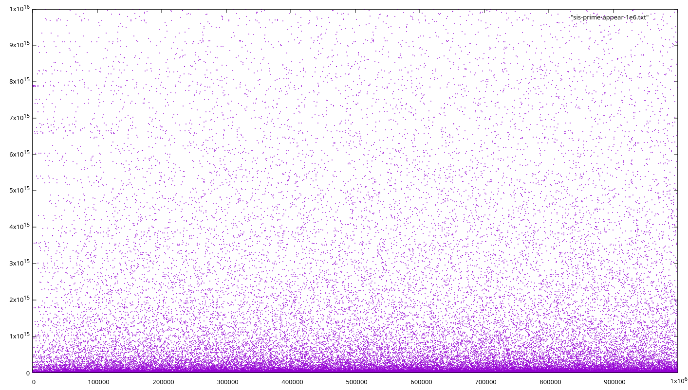
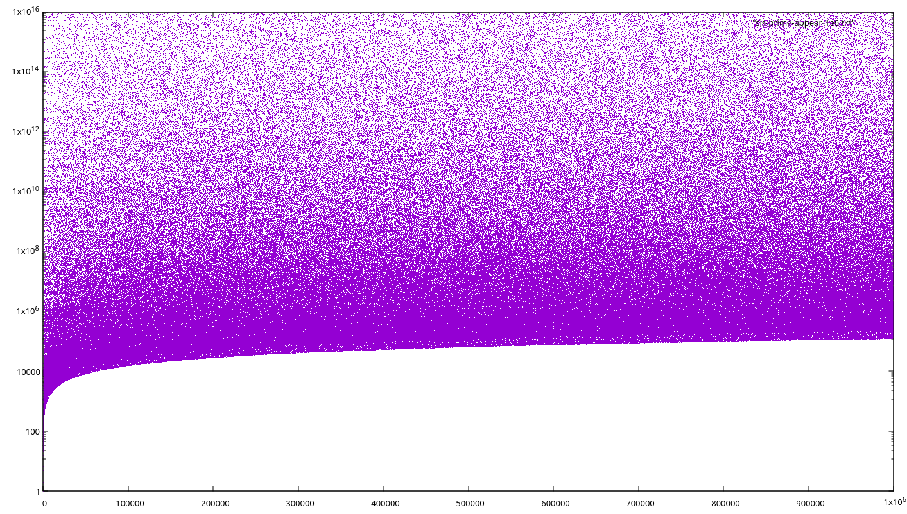

### The sequence

The Sisyphus sequences are defined by simple iterative rules: if the previous term was even, we divide by two; if the previous term was odd, then we add something. For [A350877](https://oeis.org/A350877), which actually bears the Sisyphus name in the OEIS, we add the next prime which has not yet been added. For [A347297](https://oeis.org/A347297), (the "simple" sequence), we add the next integer which has not yet been added.

The resulting behavior is interesting, as the sequence rises up by ever-larger steps before falling back down again as all the powers of 2 are divided out. The OEIS entry has some nice scatterplots showing the patterns created. It's conjectured that every number will eventually appear, and to get a feel for whether that's likely to be true we can look for record-low values, when we see the lowest number which has not previously appeared in the sequence.

### Computation - simple version

The simple sequence is straightforward to compute. We can speed things up by observing that because we only add when the previous term was odd and the addition steps are adding sequential numbers, we will always add an even number, then add an odd number, then divide by 2 some number of times. So our main loop can always do "add, add, divide", and we can combine the additions by just tracking a single value which is `next_i + next_i + 1`. To do the division, we can use `__builtin_ctzl()` to count the number of trailing zeros (powers of 2) and then shift by that amount. The final inner loop is totally branchless and very small:
```
// Start with val odd and next_i even so we know we will always add twice and then divide
while (1) {
    // We can do both additions at once, and track only the value of (nexti + nexti+1)
    val += nextinc;
    nextinc += 4;

    // Result is even, so shift
    int zeros = __builtin_ctzl(val);
    val >>= zeros;

    steps += zeros + 2; // Two addition steps and 'zeros' divisions
}
```

On my home machine this computes 10 billion terms every 3 seconds, or about one term every 1.3 clock cycles (the full version has some additional checks for small values and printing status updates).

### Computation - prime version

The prime-addition sequence uses very similar code, except that since we are always adding an odd number we will always add just once and then divide. To generate the primes, I use the amazing [primesieve library](https://github.com/kimwalisch/primesieve). I create a pool of shared memory regions using `mmap` with the `MAP_ANONYMOUS | MAP_SHARED` flags, and spawn an equal number of threads, each of which is each responsible for generating primes within a region and writing them into one of the shared buffers. The main program waits for the next thread in line to finish, consumes all of the primes in its buffer, and then launches a new thread to refill it. 

As long as there are enough prime-generating threads in the pool, this allows the main thread to compute terms of the sequence at full speed. On my machine it takes about 13 generators to keep the main thread fed, and it runs at about half the speed of the simple version. It's slower partly because it only does two terms per loop, and partly because it has to stream primes from memory instead of just using a simple increment. But it's still computing one term every 2.5-3 cycles, consuming ~550 million primes (~4.5GB of data) per second.

### Results - prime version

I computed the main Sisyphus sequence [A350877](https://oeis.org/A350877) to 10<sup>16</sup> terms, finding one new record-low value: 127 finally appears at term 7,897,675,381,151,340, more than two orders of magnitude further out than the previous record-low value of 115.

After 10<sup>16</sup> terms, the first few numbers which have not yet appeared are 167, 211, 296, 360, 443, 497, 639, 695, 765, 803, 843, 909, 995, 996. Here are [the 101680 numbers under 10<sup>6</sup> which have not appeared](sis-prime-missing-1e6.txt), arranged in 56205 "chains" of powers of 2 times a small missing number. And here are [all the numbers up to 10<sup>6</sup> which have appeared](sis-prime-appear-1e6.txt).

A plot of numbers up to 10<sup>6</sup> and where they appear does not reveal any structure, either on a linear scale or log scale -- new small numbers continue to occur with steadily decreasing frequency.

[](sis-prime-appear.png) [](sis-prime-appear-log.png)

The last known term is a350877(10000000000000008) = 839852466559541, with 127874181528808199 the last prime added. This is enough information to resume the computation.

### Results - simple version

I computed the simple Sisyphus sequence [A347297](https://oeis.org/A347297) to 2.5*10<sup>16</sup> terms. Record-low values and where they occur were not previously entered in the OEIS, so this created two new sequences Axxx and Axxx, for the values and indices at which they occur:
```
               n  a(n)
               2   2
               4   3
              14   4
              27   5
             150   11
           45887   13
          104251   110
          148658   163
         2050771   305
         7757586   520
        29390861   749
       301579233   795
      1313493823   1447
      1440132798   7456
     62259184143   7525
     66102190516   10740
   2355483842842   13835
  19780805300961   35749
  88805718863570   61616
 149849331459571   76195
1025170384787316   190909
1207194431113555   460597
2011124785827447   505823
4244919354512002   552247
```
After 2.5*10<sup>16</sup> terms, the only value under 10<sup>6</sup> which has not appeared is 579881. There was a "near miss" at a(9,721,580,668,313,845) = 642436, which filled in the only other missing number under 10<sup>6</sup>. Here are [all the numbers up to 10<sup>6</sup>]() which have appeared.

The sequence also goes all the way down to 1 a number of times, though the last was less than 3% of the way to the end of the computation. The indices of the terms which are 1 became the new sequence Axxx.

The final known term is a347297(x)=x, with x the next number to be added. This is enough information to resume the computation; but since I only tracked the appearance of numbers up to 10<sup>6</sup>, only one more record-low term can be found. More than that would need to restart at the beginning and track more small values.
